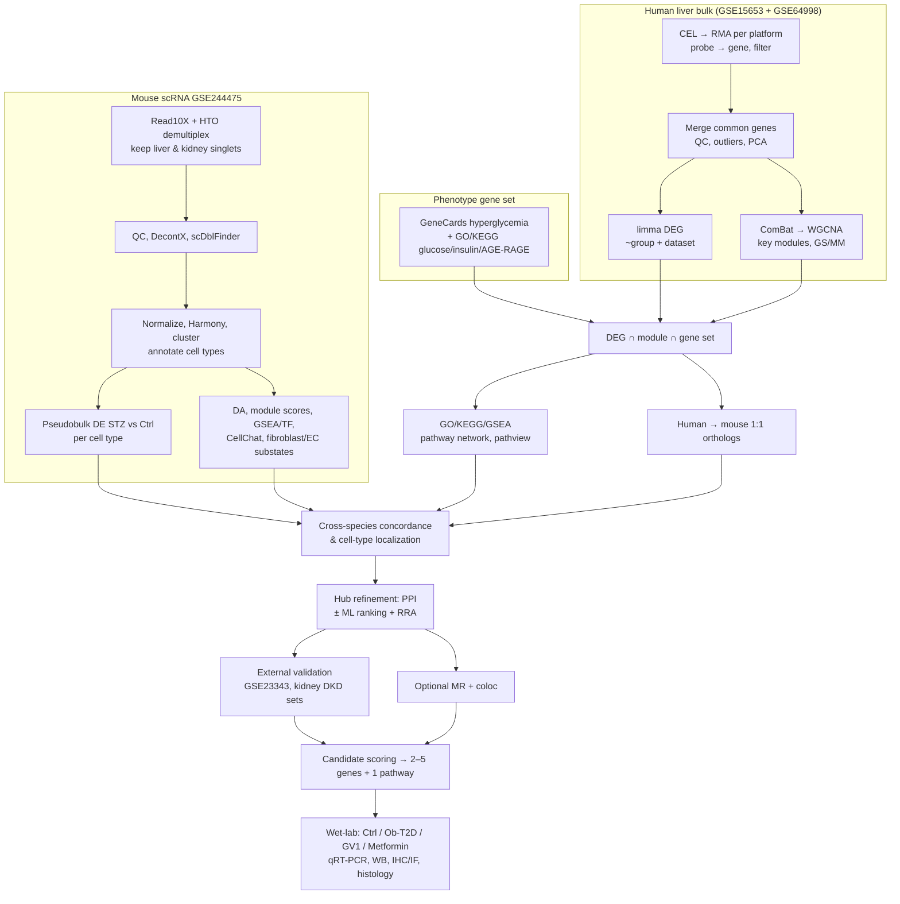

# Analysis Plan: Integrated Bulk + Single-Cell Discovery of Hyperglycemia-Associated Liver/Kidney Signatures for GV1 Validation

**Project:** From Single-Cell Multi-Organ Profiling to In Vivo Validation: Identification of Hyperglycemia-Associated Gene Signatures and Their Modulation by *Bacillus velezensis* GV1 in Ob-T2D Mice
**Analytical framework reference:** Xu et al., *Phytomedicine* 154 (2026) 158050. We borrow the framework only (bulk DEG → WGCNA → phenotype gene-set intersection → enrichment → scRNA cell-type localization → genetic/causal support → experimental validation). The disease, datasets, species and intervention here are different.
**Scope source:** `references/Niaj-T2D_Single-Cell Research Collaboration Intake.docx`
**Status:** Draft v1 (2026-09-14). Nothing has been run yet.

---

## 1. Research question (from the intake form)

> Which cell-specific transcriptional signatures contribute to hyperglycemia-associated dysfunction in the liver and kidney, and how are these signatures modulated by GV1 treatment?

What the computational work has to deliver:
1. Robust cell-type-specific hyperglycemia-associated genes and cell states in liver and kidney.
2. The pathways those genes belong to.
3. Independent computational support: human bulk tissue, external datasets, and optionally human genetics.
4. A short list (2 to 5) of high-confidence genes/proteins plus one pathway that can be tested by qRT-PCR, Western blot and IHC in the Control / Ob-T2D / GV1 / Metformin mouse groups.

---

## 2. Data inventory (checked against local files and GEO on 2026-09-14)

| Dataset | Type | Platform | Species / tissue | Samples | Groups |
|---|---|---|---|---|---|
| **GSE15653** | Bulk microarray, raw CEL (18) | GPL96, Affymetrix HG-U133A | Human liver (surgical biopsy) | 18 (15 F / 3 M) | Lean 5 · Obese non-DM 4 · Obese DM well-controlled 5 · Obese DM poorly-controlled 4 |
| **GSE64998** | Bulk microarray, raw CEL (21) | GPL11532, Affymetrix HuGene 1.1 ST | Human liver | 21 (all M) | Non-obese healthy 6 · Obese non-diabetic 8 · Obese T2D 7 |
| **GSE244475** | scRNA-seq, 10x (Cell Ranger 5.0.1 filtered matrices) | GPL24247 | Mouse C57BL/6J male, 12–14 wk; heart/kidney/liver/spleen **hashtag-multiplexed in each lane** | 7 lanes (3 control, 4 STZ); 13–26k barcodes per lane, ~110k barcodes total | Control 3 · STZ (low-dose, 6 wk, glucose >13.9 mM) 4 |

**Pooled bulk design (n = 39):** Lean/non-obese 11 · Obese non-diabetic 12 · Obese T2D 16.
Covariates available: HbA1c, fasting glucose/insulin, BMI and age for GSE15653 only; sex for both.

### Data facts that shape the plan

- **The scRNA matrices contain hashtag (HTO) counts.** Each lane has 32,285 genes plus 4 `Custom` features (`HTO-Heart`, `HTO-Kidney`, `HTO-Liver`, `HTO-Spleen`). Tissues must be demultiplexed before anything else. The HTO row order is different in GSM7817711, GSM7817714 and GSM7817715 (`HTO-Spleen` sits in a different position), so HTOs **must be matched by name, not by index**.
- **Only filtered barcodes are provided**, with no raw/empty droplets. SoupX cannot be run in its standard mode, so ambient RNA has to be handled with DecontX.
- **Species, model and organ mismatches:**
  - Bulk data are *human obese ± T2D liver*.
  - scRNA data are *mouse STZ (insulin-deficient, non-obese) hyperglycemia*.
  - The validation model is *mouse HFD/STZ Ob-T2D*.
  - Genes that agree across human obese-T2D and mouse STZ are the ones most likely to be driven by hyperglycemia and to transfer to the HFD/STZ model. This concordance is the core integration logic (Section 5.8).
- **No kidney bulk data is in `data/`.** Kidney candidates would have single-cell support only unless an external kidney dataset is added (Decision D3).
- **Sex and batch are partly confounded:** GSE64998 is all male and GSE15653 is mostly female. Dataset/batch has to be modelled, and sex checked in a sensitivity analysis.
- GSE15653 "Lean_rep3" has BMI 29.9 (overweight) and "Lean_rep1" has no BMI recorded. Flag both in QC.
- Earlier exploratory work in `ml_ref/` used GEO Series Matrix values, a *Lean vs all-Obese* contrast, and removed 3 PCA outliers (final 10 Control / 26 Disease). This plan re-derives everything from raw CEL files, so those results (e.g., CCL7, CUL3, LPCAT3, GOLM1, GPR88) become a comparison point rather than an input (Decision D6).

---

## 3. How the reference framework maps to this project

| Reference paper (RA, neutrophil migration) | This project (Ob-T2D / hyperglycemia, liver + kidney) | Change and reason |
|---|---|---|
| 3 synovium bulk datasets, sva batch removal | 2 human liver arrays from raw CEL, RMA per platform, gene-level merge, ComBat | Raw data available; different platforms |
| limma DEG, \|log2FC\| > 0.5, BH adj.P < 0.05 | Same thresholds, 3-group limma with **dataset as a covariate** (not DE on ComBat output) | Avoids the inflated significance that comes from running DE on ComBat-adjusted data |
| WGCNA, module most correlated with RA | WGCNA on batch-corrected data; traits T2D, obesity, group, HbA1c; plus module preservation across datasets | Two batches, so modules need a robustness check |
| GeneCards "neutrophil migration" set (score > 8) | Curated **hyperglycemia/insulin-resistance gene set** (GeneCards + GO/KEGG), plus a data-driven STZ scRNA set | Phenotype of interest is hyperglycemia |
| Venn of DEG ∩ module ∩ phenotype set | Same, then human→mouse 1:1 orthologs | Cross-species step |
| GO/KEGG, pathway network, pathview | Same, plus GSEA on the full ranked list, with the correct background universe | More robust for a small n |
| scRNA (1 mouse per group, Wilcoxon test on cells) | scRNA with 3 vs 4 mice, HTO demultiplexing, **pseudobulk DE using the mouse as the replicate**, liver and kidney separately | Avoids pseudoreplication; handles multiplexing |
| Candidate co-expression and correlation in neutrophils | Candidate/pathway localization by cell type, STZ vs control, module scores, cell–cell communication | Intake asks for cell-type specificity |
| MR (eQTLGen cis-eQTL → RA GWAS) | *Optional:* MR + colocalization, cis-eQTL (GTEx liver/kidney, eQTLGen) → T2D, glycemic traits, eGFR | Human causal support for chosen targets |
| UHPLC-MS + docking/MD of herbal compounds | **Not applicable by default.** GV1 is a live probiotic, not a defined compound mixture. Only possible if GV1 metabolites are characterised (D5) | Different intervention |
| In vitro + CIA rat validation (WB, qPCR, H&E) | Control / Ob-T2D / GV1 / Metformin mice, liver + kidney: qRT-PCR, WB, IHC/IF, histology | Lab's existing model |
| *(not in paper)* | Optional ML feature ranking + RRA (reuse `ml_ref/`), external validation (GSE23343 etc.) | Intake requests independent validation |

---

## 4. Workflow overview



---

## 5. Detailed phases

Each phase lists its inputs, the method with parameters fixed in advance, its outputs, and a QC gate that must pass before moving on.

### Phase 0: Project setup

- Directory layout:
  ```
  data/        raw, read-only (already present)
  docs/        plans, decisions log, methods text
  scripts/     00_setup.R, 01_bulk_preprocess.R, ... numbered by phase
  results/     bulk/, sc/, integration/, validation/ (tables, .rds)
  figures/     per-phase figures (PDF + 300 dpi TIFF)
  ```
- Environment: R 4.6.1 (installed), managed with `renv`. Python 3.11 with scanpy/celltypist is available as a secondary option.
- Already installed: Seurat, SeuratObject, limma, sva, WGCNA, clusterProfiler, glmnet, randomForest, e1071, pROC, GSVA, harmony, DESeq2, edgeR, biomaRt, babelgene, msigdbr, ggvenn.
- **To install:** `oligo`, `pd.hg.u133a`, `pd.hugene.1.1.st.v1`, `hgu133a.db`, `hugene11sttranscriptcluster.db`, `arrayQualityMetrics`, `fgsea`, `pathview`, `enrichplot`, `STRINGdb`, `RobustRankAggreg`, `scDblFinder`, `celda` (DecontX), `SingleR`, `celldex`, `glmGamPoi`, `presto`, `clustree`, `speckle`, `miloR`, `UCell`, `decoupleR`, `CellChat` (GitHub jinworks), `Nebulosa`. Optional: `TwoSampleMR`, `coloc`, `ieugwasr` (needs an OpenGWAS API token).
- Hardware: 12 cores, 31 GB RAM. Process scRNA per tissue after demultiplexing and do not keep all four organs in memory together.
- Fix `set.seed()` and record `sessionInfo()` in every script.

### Phase 1: Bulk preprocessing (human liver)

1. **Import and normalize per platform.**
   - GSE15653: `oligo::read.celfiles` → `rma()`.
   - GSE64998: `oligo::rma(target = "core")`.
   - Array QC with `arrayQualityMetrics`: NUSE/RLE, intensity distributions, MA plots.
2. **Annotate** with `hgu133a.db` / `hugene11sttranscriptcluster.db`. Drop control probes and probes with no or multiple symbols. Collapse to gene level with `WGCNA::collapseRows(method = "MaxMean")`.
3. **Filter low expression** within each dataset: keep genes above the 25th-percentile intensity in at least as many samples as the smallest group.
4. **Merge** on common gene symbols (expect roughly 10–12k genes) and build a sample metadata table:
   `GSM, dataset, group3 {Lean, ObeseND, ObeseT2D}, T2D (0/1), obese (0/1), sex, age, BMI, HbA1c`.
5. **Batch handling.**
   - `sva::ComBat(batch = dataset, mod = ~group3)`. The output is used **only** for PCA, WGCNA, heatmaps and ML.
   - DE uses the uncorrected merged matrix with dataset in the model (Phase 2).
6. **Outliers:** PCA before and after ComBat, hierarchical clustering (WGCNA sample tree), and `arrayQualityMetrics` flags. Remove a sample only when at least 2 methods flag it, and record the reason.

*Outputs:* `expr_merged_raw.rds`, `expr_merged_combat.rds`, `meta_bulk.csv`, PCA figure before/after (analogue of paper Fig 1A).
*QC gate:* After ComBat, samples separate by group rather than by dataset in PC1/PC2, and no platform-driven clusters remain.

### Phase 2: Bulk differential expression

- Model: `limma` with `design = ~0 + group3 + dataset`, optionally `arrayWeights`, then `eBayes(trend = TRUE)`.
- **Comparison (D1b, decided by the user 2026-09-14): T2D vs lean Control, 27 samples.**
  - GSE15653: 5 lean controls (GSM391693–97) vs 9 T2D (GSM391702–10).
  - GSE64998: 6 non-obese controls (GSM1585592–97) vs 7 T2D (GSM1585585–91).
  - Obese non-diabetic samples are excluded.
  - Model: `~condition + dataset`.
  - The single-cell counterpart is STZ vs Control.
  - Caveat: T2D status is collinear with obesity in this design.
- **DEG definition (M9, decided by the user 2026-09-14):** nominal P < 0.05 and |log2FC| > 0.5, labelled exploratory. 84 genes reach FDR < 0.05 for T2D vs Control but only 31 of those also clear |log2FC| > 0.5, and carrying that set through the strict module and gene-set rules leaves a single intersecting gene (SREBF2, R17), which is why the nominal rule is used. The FDR column is reported throughout.
- **Input (M8):** raw CEL + RMA, no expression filter (all genes common to both platforms).
- **Candidate rule (M13, replaces M10):** the reference paper's 3-way overlap. DEGs ∩ all genes of the key modules (T2D p < 0.1, not dataset-driven; M11) ∩ hyperglycemia gene set. WGCNA hub status (|kME| > 0.7, |GS| > 0.2) is kept as an annotation.
- DEG threshold (same as the reference): |log2FC| > 0.5 and BH adj.P < 0.05. If C1 yields fewer than 100 DEGs, fall back to nominal P < 0.01 with |log2FC| > 0.5 and report this openly.
- Sensitivity analyses:
  - add `sex` as a covariate;
  - run each dataset separately and check direction concordance (sign agreement ≥ 80% of DEGs);
  - within GSE15653, regress expression on HbA1c.

*Outputs:* full topTables for C1–C3, volcano plots (Fig 1B analogue), heatmap of top 50 DEGs.

### Phase 3: WGCNA

- Input: ComBat matrix, all filtered genes, or the top 5,000 genes by MAD if fewer than 30 samples remain after QC. Samples × genes after `goodSamplesGenes`.
- Signed-hybrid network, `bicor` correlation, `pickSoftThreshold` over powers 1–20.
  - Choose the lowest power with scale-free R² ≥ 0.80.
  - If R² never reaches 0.80, use the Langfelder guideline for 30–40 samples (power 7 unsigned / 14 signed).
- `blockwiseModules`: `minModuleSize = 30`, `mergeCutHeight = 0.25`, `deepSplit = 2`.
- Module–trait correlation with traits `T2D`, `obese`, `group3` (ordinal), `dataset` (confounding check), and `HbA1c` (GSE15653 subset).
- Key modules: the module with the highest positive and the module with the highest negative correlation with T2D (p < 0.05). Discard any module that correlates more strongly with `dataset` than with T2D.
- Robustness: `modulePreservation` with GSE15653 as reference and GSE64998 as test. A module counts as preserved when Zsummary > 10, and moderately preserved when 2–10.
- Compute GS (T2D) and MM (kME) for each gene. Intramodular hubs are genes with |MM| > 0.8 and |GS| > 0.2.

*Outputs:* soft-threshold plot, dendrogram with colors, module–trait heatmap, MM–GS scatter (Fig 1C–F analogues), module gene tables.

### Phase 4: Phenotype gene set and intersection

- **Hyperglycemia gene set** (analogue of the reference's GeneCards neutrophil-migration set), built as the union of:
  - GeneCards search "hyperglycemia" (and "insulin resistance"). Use relevance score > 8 as in the reference, adjusted so the set holds about 500–1,000 genes. Export the table and record the date and version.
  - MSigDB via `msigdbr`: GO:BP *response to glucose* (GO:0009749), *cellular response to glucose stimulus* (GO:0071333), *response to insulin* (GO:0032868); KEGG *AGE-RAGE signaling pathway in diabetic complications* (hsa04933), *Insulin resistance* (hsa04931).
- **Intersection:** DEG(C1) ∩ key-module genes ∩ hyperglycemia set, drawn with `ggvenn` (Fig 1G analogue).
- **Parallel data-driven arm, run in Phase 7:** replace the curated set with orthologs of genes that are DE in STZ vs control in at least one liver cell type. This checks that curation bias is not driving the result.
- If the triple intersection has fewer than about 20 genes, report DEG ∩ module as the main set and use the hyperglycemia set as an annotation layer.
- Tag each gene as C2-significant or not ("hyperglycemia-driven" vs "obesity-associated").

### Phase 5: Functional enrichment

- ORA with `clusterProfiler::enrichGO` (BP/CC/MF) and `enrichKEGG` on the intersect genes. **The universe is all genes kept after Phase 1 filtering**, not the whole genome. Significance: BH adj.P < 0.05.
- GSEA with `fgsea` on the C1 and C2 ranked lists (moderated t), using Hallmark, KEGG and Reactome. This is less sensitive to thresholds.
- Visualisation: GO bar/dot plot (Fig 2A), KEGG bubble plot (Fig 2B), `enrichplot::emapplot` pathway interaction network of the top 30 terms (Fig 2C), and `pathview` diagram for the lead KEGG pathway coloured by C1 logFC (Fig 2D).
- **Decision point D2:** pick one focal biological process or pathway to carry forward, as the reference did with actin cytoskeleton → RAC/PAK. Likely candidates from the STZ source paper are fibroblast metabolic dysregulation/ECM, endothelial dysfunction/EndMT, and macrophage/monocyte inflammation. The final choice depends on the data.

### Phase 6: scRNA-seq preprocessing (GSE244475)

1. **Load** each lane with `Read10X(gene.column = 2)`, which returns separate *Gene Expression* and *Custom* (HTO) matrices. Select HTO rows by name. Add metadata `sample`, `mouse_id`, `condition` {Control, STZ}.
2. **Demultiplex tissues (hybrid HTO + RNA; revised 2026-09-14, decision S2).**
   - Apply the source paper's light QC first: 300–5,000 genes, ≤25,000 UMIs, ≤25% mito.
   - Run `HTODemux(positive.quantile = 0.99)` on CLR-normalized HTOs, plus `MULTIseqDemux`.
   - Why HTO alone is not enough: hashtag labels are reliable for liver-restricted cells and kidney endothelium, but kidney tubular epithelium and stromal cells are mostly HTO-Negative, and their singlet calls are unreliable.
   - Clusters dominated by a tissue-restricted parenchymal program (kidney tubular, hepatocyte) are assigned by RNA.
   - HTO singlets keep their tag unless RNA kNN strongly disagrees (probability <0.2).
   - HTO-Negatives are rescued by kNN (k = 30, trained on confident HTO singlets) when probability ≥0.8.
   - Report CV accuracy and the per-tissue share of HTO / kNN / override cells. The source paper retained about 67.6k cells across 4 organs, which serves as a sanity check.
3. **Subset liver and kidney** into separate objects. Archive heart and spleen for an optional organ-specificity check (D4).
4. **Cell QC** per tissue:
   - nFeature ≥ 200; genes detected in ≥ 3 cells (as in the reference);
   - hemoglobin genes (`Hba-a1`, `Hba-a2`, `Hbb-bs`, `Hbb-bt`) < 3% (as in the reference);
   - mitochondrial %: the reference used < 10%, but kidney proximal-tubule cells and hepatocytes are mito-rich, so use a per-tissue MAD cut-off (median + 3 MAD, capped at 20% for liver and 30% for kidney). Report how many cells the 10% rule would keep as a sensitivity check;
   - upper nCount/nFeature at median + 5 MAD.
5. **Ambient RNA:** `celda::decontX` per lane on raw counts. Watch leakage of hepatocyte transcripts (`Alb`, `Apoa1`, `Apoc3`, `Serpina1c`) and proximal-tubule transcripts (`Kap`, `Slc34a1`, `Lrp2`) into non-parenchymal cells. Keep decontaminated counts for clustering and DE.
6. **Within-tissue doublets:** `scDblFinder` per lane (HTO demultiplexing only catches cross-tissue doublets).
7. **Normalize and integrate:** `SCTransform(vst.flavor = "v2")`, or LogNormalize for DE-oriented work. 2,000 HVGs, PCA, then Harmony on `sample` **only if** lanes separate in UMAP. UMAP on 20 PCs (as in the reference). Louvain clustering over resolutions 0.2–1.2, choosing with `clustree`.
8. **Annotation.** Combine three sources:
   - (a) canonical markers from CellMarker 2.0, PanglaoDB and the Braithwaite et al. 2024 source paper;
   - (b) `SingleR` against `celldex::ImmGenData` / `MouseRNAseqData`;
   - (c) cluster markers from `FindAllMarkers`/`presto`.

   | Tissue | Expected cell types (marker genes) |
   |---|---|
   | Liver | Hepatocytes (`Alb`, `Apoa1`) · LSEC (`Kdr`, `Stab2`, `Clec4g`) · Kupffer cells (`Clec4f`, `Vsig4`) · monocytes/mo-macs (`Ly6c2`, `Ccr2`) · HSC/fibroblasts (`Dcn`, `Reln`, `Lrat`, `Pdgfrb`) · cholangiocytes (`Krt19`, `Epcam`) · B, T, NK, neutrophils, DCs |
   | Kidney | PT (`Lrp2`, `Slc34a1`) · LoH (`Umod`, `Slc12a1`) · DCT (`Slc12a3`) · CD-PC (`Aqp2`) · CD-IC (`Atp6v1g3`) · podocytes (`Nphs1`, `Nphs2`) · endothelial (`Emcn`, `Plvap`, `Pecam1`) · fibroblasts/pericytes (`Pdgfrb`, `Col1a1`) · macrophages (`C1qa`, `Adgre1`) · lymphocytes |

   Priority populations named in the intake: **endothelial, epithelial, immune, macrophage/monocyte, fibroblast**.

*Outputs:* `liver_annotated.rds`, `kidney_annotated.rds`, QC tables, UMAPs, marker dot plots (Fig 3A–B analogues), cell-composition bars per sample (Fig 3C analogue).
*QC gate:* Every major cell type contains cells from all 7 mice. Parenchymal-cell capture is documented (the dissociation may under-represent hepatocytes).

### Phase 7: scRNA disease analyses (STZ vs Control)

1. **Pseudobulk DE (primary).**
   - Sum counts per `mouse × cell type` with `AggregateExpression`. Keep cell types with ≥ 20 cells in at least 3 mice per group.
   - Test with `edgeR` quasi-likelihood (`~condition`), or `DESeq2` as a check.
   - Threshold: FDR < 0.05, |log2FC| > 0.5.
   - Cell-level `FindMarkers` (Wilcoxon/MAST) is used only for display and sensitivity analysis. It must not be the primary test, because it treats cells as independent replicates (pseudoreplication).
2. **Differential abundance:** `speckle::propeller` (logit) on cell-type proportions, plus `miloR` neighbourhood DA. With 3 vs 4 mice these are exploratory. Compare with the source paper (e.g., the increase in myeloid-like fibroblasts).
3. **Pathway and regulator activity:**
   - `fgsea` on pseudobulk logFC per cell type (mouse MSigDB Hallmark/GO/KEGG);
   - `decoupleR` with CollecTRI (transcription factors) and PROGENy (14 signalling pathways) per cell type.
4. **Transferring the human signature:** score every cell with `UCell` using orthologs of the Phase 4 intersect genes (split into up and down sets). Test STZ vs control per cell type on per-mouse mean scores. This identifies *which cell type carries the human Ob-T2D liver signature* and is the main bridge between bulk and scRNA.
5. **Candidate localization** (Fig 3D–G analogue): for each ortholog candidate, show a DotPlot/violin by cell type × condition, a `Nebulosa` density UMAP, co-expression of pathway partner genes, and Pearson correlation on pseudobulk values (cell-level correlation is dominated by dropout).
6. **Substates:** subcluster fibroblasts/HSC and endothelial cells in each organ. Compute an EndMT score (endothelial markers down, mesenchymal markers up) and identify disease-enriched substates.
7. **Cell–cell communication:** `CellChat` v2 per condition, then `compareInteractions` / `rankNet`. Focus on ligand–receptor pairs that involve prioritized candidates or the focal pathway.
8. *Optional:* trajectory analysis (slingshot) within fibroblast or monocyte→macrophage lineages, only if a disease-enriched substate appears.

*Outputs:* per-cell-type pseudobulk DE tables (liver, kidney), DA table, GSEA/TF tables, signature-score plots, CellChat comparison plots.

### Phase 8: Cross-species integration and candidate tiering

- Map human → mouse with `babelgene` (1:1 orthologs only) and report how many genes are lost in mapping.
- For each candidate gene, collect:
  - human bulk: C1 logFC/FDR, C2 significance, WGCNA module, GS, MM;
  - mouse scRNA: pseudobulk logFC/FDR in each liver and kidney cell type, the cell type with the highest expression, and a specificity index (tau).
- **Tiers:**
  - **Tier 1:** Bulk DEG (C1) **and** STZ pseudobulk DE in at least one liver cell type **with the same direction**.
  - **Tier 2:** Strong bulk evidence (DEG + hub, C2-significant) and cell-type-restricted expression in scRNA, but not DE in STZ.
  - **Tier 3 (kidney):** STZ pseudobulk DE in kidney cell types with human kidney support from external data (Phase 10). Without that support, label the gene *exploratory*.
- Optional low-priority step: deconvolve the human bulk with a scRNA reference (e.g., `BayesPrism` / `MuSiC`) to test whether cell-proportion shifts explain bulk DEGs. The reference is from another species and hepatocytes may be under-captured, so results are interpreted qualitatively.

### Phase 9: Hub-gene refinement

- **PPI:** `STRINGdb` (score ≥ 400) on Tier 1–2 genes, then `igraph` degree/betweenness/MCC-like ranking. Top hubs are consensus hubs across at least 2 metrics.
- **ML feature ranking (optional, reusing `ml_ref/`).** Limit to about 5 complementary methods: LASSO, elastic net, RF/Boruta, SVM-RFE, XGBoost + SHAP.
  - Combine rankings with `RobustRankAggreg`.
  - Guardrails, because n ≈ 39 with 2 batches:
    - repeated stratified *nested* CV;
    - any batch correction and feature selection happen inside training folds;
    - results are reported as **feature ranking, not a diagnostic model**;
    - AUCs are not claimed without external validation.
  - The `ml_ref` pipeline runs about 30 methods on ComBat data computed before the CV split, which leaks information between folds. Tighten this before reuse.

### Phase 10: Independent computational validation

| Purpose | Dataset (confirm suitability before use) | Test |
|---|---|---|
| Human liver, T2D | **GSE23343** (liver, T2D vs normoglycemic, GPL570; already used in `ml_ref/validation.ipynb`) | Direction and effect size of candidates; single-gene and signature ROC |
| Human kidney, diabetic kidney disease | GSE30122 (glomeruli/tubuli), GSE96804 (glomeruli), GSE104948 / GSE104954 (ERCB glomeruli / tubulointerstitium) | Kidney candidates (Tier 3), cell-type-matched compartment |
| Mouse liver/kidney, other diabetes models | Search GEO for HFD/STZ, db/db, ob/ob liver and kidney bulk datasets (to be identified) | Model transferability to HFD/STZ |
| Organ specificity | GSE244475 heart and spleen | Separates hyperglycemia-general genes from liver/kidney-specific genes |
| Human genetics and protein detectability | T2D Knowledge Portal gene-level associations, Open Targets, Human Protein Atlas (antibody and tissue protein) | Prioritization evidence |

### Phase 11 (optional): Genetic causal support (MR)

This follows the reference's MR design, adapted to T2D. It is only worth running for final candidates with a human ortholog and cis-eQTLs.

- **Exposure:** cis-eQTLs within ±100 kb, P < 5×10⁻⁸ (relax to 5×10⁻⁶ for GTEx tissues and report it), EAF > 0.01, clumping r² < 0.001 within 10,000 kb, F > 10.
- **eQTL sources:** eQTLGen whole blood, which is well powered (as in the reference), and GTEx v8 liver and kidney cortex, which are tissue-matched but low powered.
- **Outcomes:** T2D GWAS (DIAGRAM/DIAMANTE or an IEU OpenGWAS T2D study; confirm the ID), MAGIC fasting glucose/HbA1c, and CKDGen eGFR for kidney candidates.
- **Methods:**
  - estimation: IVW (or Wald ratio for a single SNP), weighted median, MR-Egger, simple/weighted mode;
  - diagnostics: Cochran's Q, Egger intercept, Steiger directionality;
  - **added beyond the reference:** `coloc` (PP.H4 > 0.8), to rule out LD-driven false positives.
- Druggability annotation from Finan et al. 2017 druggable genome tiers, DGIdb and Open Targets tractability.
- Practical note: IEU OpenGWAS API access now requires a personal token.

### Phase 12: Candidate prioritization

Score each Tier 1–3 gene on 0–3 per criterion. The weights reflect the intake form's "High" criteria and budget constraints.

| Criterion | Weight | Evidence |
|---|---|---|
| Bulk DE strength (C1), plus C2 hyperglycemia tag | 2 | limma logFC/FDR |
| scRNA STZ DE in a priority cell type, direction concordant with bulk | 3 | pseudobulk FDR/logFC |
| Cell-type specificity | 1 | tau, DotPlot |
| Network centrality (WGCNA MM/GS, PPI hub) | 1 | Phases 3 and 9 |
| External validation reproducibility | 2 | Phase 10 |
| Clinical/genetic association | 1 | HbA1c correlation, T2DKP, MR/coloc |
| **Protein detectability** (validated mouse antibody, WB/IHC) | 2 | HPA, vendor validation data |
| Literature plausibility in diabetes liver/kidney | 1 | PubMed |
| Druggability | 1 | Finan tiers, DGIdb |
| Experimental feasibility (qPCR-detectable in whole tissue) | 1 | pseudobulk expression level |

**Selection:**
- 2–5 genes for validation, covering at least one liver and one kidney candidate where the evidence allows;
- **one focal pathway** with 3–4 measurable nodes, including phospho-proteins if it is a signalling axis (as with RAC1/p-PAK1/p-LIMK1/p-Cofilin1 in the reference);
- 1–2 backup genes.

Deliver a one-page candidate dossier per gene: evidence summary, expected direction in the model, cell type for IF co-staining, and primer/antibody suggestions.

### Phase 13: Experimental validation design (GV1 model)

- **Groups:** Control · Ob-T2D (HFD/STZ) · Ob-T2D + GV1 · Ob-T2D + Metformin (positive control). Use n ≥ 6 mice per group; confirm with a power calculation from Phase 7 effect sizes.
- **Tissues:** liver and kidney.

| Level | Assay | Notes |
|---|---|---|
| mRNA | qRT-PCR, 2^-ΔΔCt | Two reference genes checked for stability in diabetic tissue (e.g., `Rplp0`, `Tbp`, `Hprt`); `Gapdh` alone is not recommended in hyperglycemic tissue |
| Protein | Western blot | Total and phospho forms for pathway nodes |
| Localization | IHC/IF co-stain with cell-type marker | CD31/Emcn (endothelium), F4/80 or Clec4f (macrophage/Kupffer), α-SMA/PDGFRβ/Desmin (fibroblast/HSC), LTL/Lrp2 (proximal tubule). This confirms the *cell-specific* claim, which whole-tissue qPCR cannot |
| Phenotype | H&E, Sirius Red/Masson (fibrosis), PAS (kidney), Oil Red O (liver lipid) | Tissue-level context |
| Metabolic | Fasting glucose, OGTT/ITT, HbA1c (from existing data) | Correlate with candidate expression |

- **Pre-registered expectations:**
  - Ob-T2D vs Control changes in the same direction as scRNA/bulk (support).
  - GV1 attenuates or reverses the change (treatment-responsive).
  - Metformin serves as the benchmark.
  - An opposite or absent change weakens the hypothesis (as defined in intake 10.7).
- **Statistics (as in the reference):** Shapiro–Wilk; one-way ANOVA + Tukey, or Kruskal–Wallis + Dunn; two-tailed α = 0.05. Pre-specify primary candidates to limit multiplicity.
- **Caveat:** the public scRNA data use STZ-only mice. Candidates expected to transfer best to HFD/STZ are Tier 1 genes that are also concordant in human obese-T2D liver.

---

## 6. Deliverables and figure map

| Figure | Content | Phase |
|---|---|---|
| Fig 1 | Bulk PCA before/after batch correction; volcano (C1); WGCNA soft threshold, dendrogram, module–trait heatmap, MM–GS; Venn | 1–4 |
| Fig 2 | GO, KEGG, pathway network, pathview of the focal pathway; GSEA | 5 |
| Fig 3 | Liver and kidney atlases (UMAP, markers, composition); human signature score by cell type; candidate expression by condition; co-expression | 6–7 |
| Fig 4 | Cell-type pseudobulk DE summary; DA; CellChat changes; fibroblast/EC substates | 7 |
| Fig 5 | Prioritization heatmap; PPI; external validation (expression, ROC); optional MR/coloc | 8–12 |
| Fig 6+ | Wet-lab validation (qPCR, WB, IHC/IF, histology) | 13 |

Supporting outputs: supplementary tables (all DE results, module genes, gene sets with source/version, candidate scores), `docs/methods_draft.md`, `docs/decisions_log.md`, reproducible scripts with `sessionInfo()`.

---

## 7. Decisions needed from the team

| ID | Decision | Recommendation |
|---|---|---|
| **D1** | Primary bulk contrast | **ObeseT2D vs Lean** (matches the validation model), with ObeseT2D vs ObeseND as the hyperglycemia tag. The earlier `ml_ref` contrast (Lean vs all Obese) mixes in non-diabetic obesity. |
| **D2** | Phenotype focus: broad "hyperglycemia" set, or a specific process (fibrosis/ECM, endothelial dysfunction, inflammation) | Start broad (Phase 4) and lock a focal process after Phases 5 and 7 |
| **D3** | Add a human kidney bulk dataset for kidney candidates | **Yes**, e.g., GSE104954 or GSE30122; otherwise kidney findings stay exploratory |
| **D4** | Include heart/spleen from GSE244475 | Only as an organ-specificity check, not a full analysis |
| **D5** | MR and docking | MR optional for final candidates. Docking only if GV1-derived metabolites (e.g., lipopeptides, SCFAs) are characterised |
| **D6** | Earlier `ml_ref` results (CCL7, CUL3, LPCAT3, GOLM1, GPR88) | Re-derive from raw CEL data under D1, then compare and note overlap |
| **D7** | Whether lab samples already exist for all 4 groups in both tissues, and whether RNA/protein is available | Confirm before Phase 12 so candidate selection matches available material |

---

## 8. Risks and mitigations

| Risk | Impact | Mitigation |
|---|---|---|
| STZ (T1D-like, lean) ≠ HFD/STZ Ob-T2D ≠ human obese T2D | Candidates may not transfer | Require cross-species/model concordance (Tier 1); external mouse-model check |
| Small scRNA replication (3 vs 4 mice) | Low power for DE and DA | Pseudobulk with mouse as replicate; effect-size filters; report DA as exploratory |
| Two bulk batches with sex imbalance | Confounded DEGs/modules | Dataset covariate in limma; per-dataset concordance; module preservation; sex sensitivity analysis |
| Few DEGs in bulk (n = 39, arrays) | Small or empty intersection | Pre-specified fallback thresholds; GSEA; data-driven scRNA arm |
| Ambient RNA and hepatocyte under-capture in scRNA liver | False cell-type "expression" | DecontX; check markers in parenchymal vs non-parenchymal cells; IF localization in the lab |
| Whole-tissue qPCR dilutes cell-type-specific changes | False negatives in validation | Prefer candidates with large effects or restricted expression; IF co-staining; optional FACS-sorted or enriched fractions |
| ML overfitting with n ≈ 39 | Inflated AUCs | Nested CV, in-fold processing, external validation; frame as ranking |
| GeneCards export is manual and versioned | Reproducibility | Save export files with date; use MSigDB sets as programmatic backup |

---

## 9. Proposed sequencing

1. **Weeks 1–2:** Phases 0–5 (bulk). Deliverables: Fig 1–2 draft; decisions D1 and D2.
2. **Weeks 2–4:** Phase 6 (scRNA preprocessing and annotation). Checkpoint: annotation review with the wet-lab team.
3. **Weeks 4–6:** Phases 7–8 (scRNA disease analysis and integration). Deliverables: Fig 3–4 draft; Tier list.
4. **Weeks 6–8:** Phases 9–12 (refinement, external validation, optional MR, scoring). Deliverable: candidate dossiers handed to the wet-lab team.
5. **Weeks 8+:** Phase 13 wet-lab validation, followed by integrated interpretation and a manuscript draft.

Phases 1–5 and Phase 6 can run in parallel because they do not depend on each other until Phase 8.
